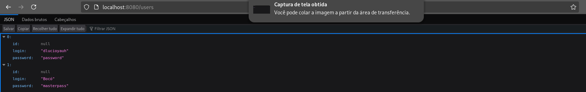
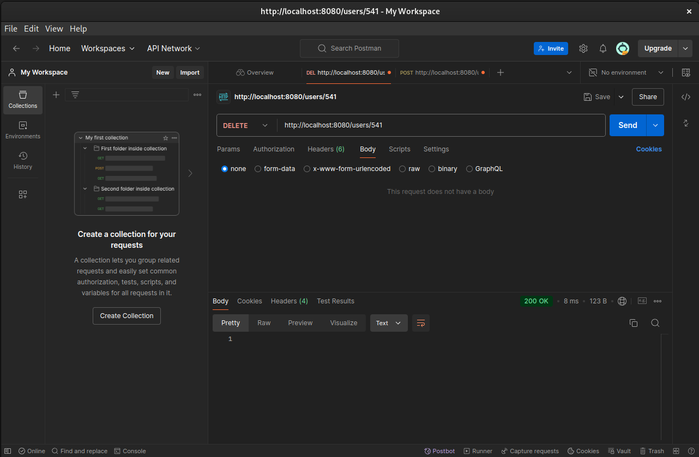
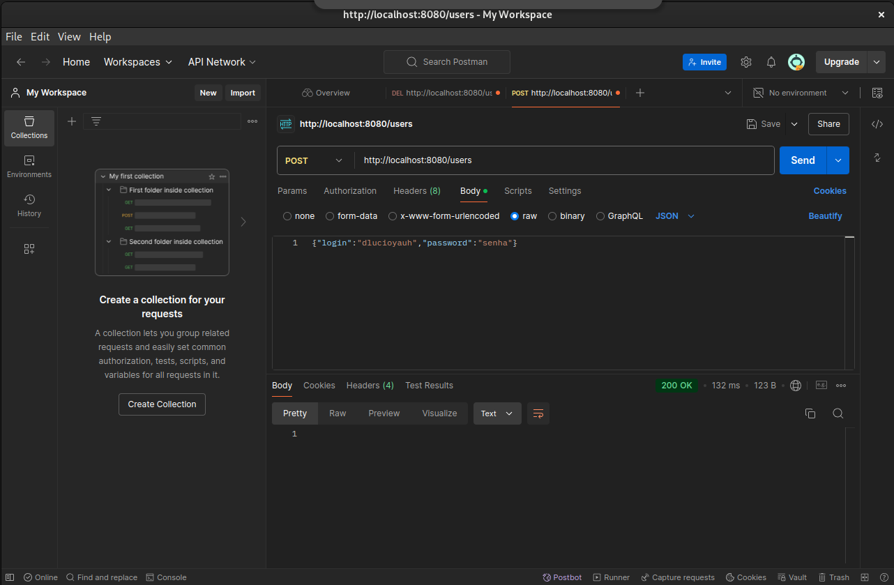

# My First Spring Boot Web API

Este é um exemplo de API RESTful utilizando Spring Boot. A aplicação permite a criação, leitura e exclusão de usuários.

## Endpoints

### 1. **GET /** - Welcome
Retorna uma mensagem de boas-vindas.

**Resposta Exemplo**:
```json
"Welcome to My Spring Boot Web API"
```
### 2. GET /users - Lista todos os usuários

Retorna uma lista de todos os usuários.

**Exemplo de Resposta**:
```json
[
  {
    "login": "dlucioyauh",
    "password": "password"
  },
  {
    "login": "Bocó",
    "password": "masterpass"
  }
]
```
### 3. GET /users/{username} - Busca usuário pelo username

Retorna as informações de um usuário específico.

**Exemplo de Resposta**:
```json
{
  "login": "dlucioyauh",
  "password": "password"
}
```

### 4. POST /users - Criação de usuário

Cria um novo usuário.

**Exemplo de Requisição**:

```json
{
  "login": "novousuario",
  "password": "senhanova"
}
```
### 5. DELETE /users/{id} - Exclui usuário

Exclui um usuário com base no ID fornecido.
## Configuração

   **1. Clone o repositório**:
```bash
git clone <url_do_repositorio>
```

   **2. Execute a aplicação com**:
```bash
mvn spring-boot:run
```
## Exemplos de Teste

### 1. Testando com o navegador:
- Acesse `http://localhost:8080/users` para listar todos os usuários.
  
**Print da Página WEB**:



### 2. Testando com o Postman:
- Exemplo de requisição GET `/users` no Postman.

**Prints do Postman**:



